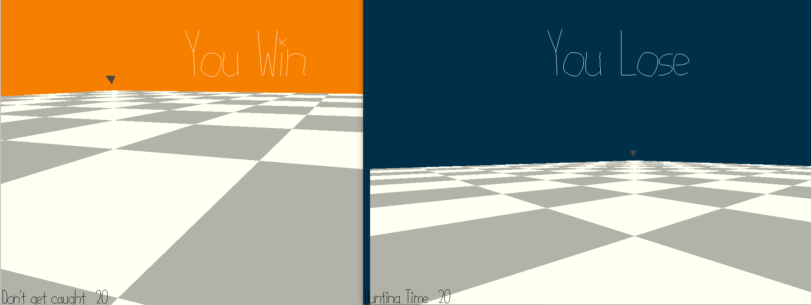

# untitled

Author: Weisheng Li

Design: Two players walking on a minesweeper board. The hunter tries to catch the prey within given amount of time (40s).

Networking: To simplify things a bit, I tried to keep as many things on the client side as possible. The scene and mesh are both stored on client, the client then send the player position to the server and query the current game state.

Screen Shot:

How To Play (It supports only 2 players):

For both player, WASD to move and mouse cursor to rotate the camera.

Each player's assigned role (hunter / prey) is shown on the button-left.

Sources: N/A

This game was built with [NEST](NEST.md).

